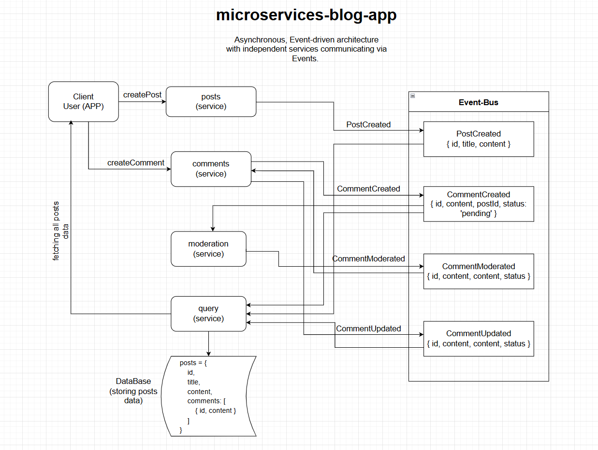

# Microservices Blog App

Event-driven “mini blog” built as a TypeScript monorepo. Users can create posts and comments; comments are moderated asynchronously. A Query service builds a read-model for the UI.

## Services (ports)

- **client** (Expo / React Native)
- **posts** (`:4000`) — write model for posts
- **comments** (`:4001`) — write model for comments per post
- **query** (`:4002`) — read model for the UI (posts + comments)
- **moderation** (`:4003`) — moderates comments
- **event-bus** (`:4005`) — in-memory event store + fan-out

## Architecture

This project follows a simple CQRS-style split:

- **Write services** (`posts`, `comments`) accept user commands and emit domain events.
- **Event Bus** receives events and forwards them to every service.
- **Query service** listens to events and materializes a read model for fast UI reads.
- **Moderation service** listens for `CommentCreated` and emits `CommentModerated`.

[](./architecture.png)

### Consistency model

The UI reads from `query`, so updates are **eventually consistent** (a short delay between creating a post/comment and seeing it reflected in the list).

### Event replay

`query` replays all stored events on startup by calling `GET /events` on the Event Bus, then re-processing each event to rebuild its in-memory read model.

## Events

Events are posted to the Event Bus at `POST http://localhost:4005/events`.

- `PostCreated` — `{ id, title, content }`
- `CommentCreated` — `{ id, postId, content, status: "pending" }`
- `CommentModerated` — `{ id, postId, content, status: "approved" | "rejected" }`
- `CommentUpdated` — `{ id, postId, content, status }`

Moderation rule: if the comment text includes the word **"orange"** (case-insensitive & can be replaced with moderation logic), it is rejected; otherwise approved.

## HTTP APIs

### posts (:4000)

- `POST /posts` → creates a post and emits `PostCreated`
- `POST /events` → receives events from the Event Bus

### comments (:4001)

- `POST /posts/:id/comments` → creates a comment with `status: pending` and emits `CommentCreated`
- `POST /events` → listens for `CommentModerated`, updates comment status, emits `CommentUpdated`

### query (:4002)

- `GET /posts` → returns the aggregated read model `{ [postId]: { id, title, content, comments[] } }`
- `POST /events` → updates the read model from incoming events

### moderation (:4003)

- `POST /events` → listens for `CommentCreated`, emits `CommentModerated`

### event-bus (:4005)

- `POST /events` → stores the event in-memory and forwards it to all services
- `GET /events` → returns all historical events (for Query replay)

## Running locally

### 1) Install dependencies

From the repo root, run `npm install` inside each folder:

```bash
cd event-bus && npm install
cd ../posts && npm install
cd ../comments && npm install
cd ../query && npm install
cd ../moderation && npm install
cd ../client && npm install
```

### 2) Start backend services (separate terminals)

```bash
cd event-bus && npm start
cd posts && npm start
cd comments && npm start
cd query && npm start
cd moderation && npm start
```

### 3) Start the client

```bash
cd client
npm run start
```

#### Note on mobile networking

The client is hard-coded to `http://localhost:4000/4001/4002`. This works in web and some emulator setups, but for a physical phone you’ll typically need to replace `localhost` with your machine’s LAN IP.

## Notes / limitations

- All services store state **in memory** (restarting a service clears its data). Only the Event Bus keeps an in-memory list of past events for Query replay.
- This is a learning/demo architecture: no auth, no persistence, no retries/backoff, and a single in-process Event Bus.
